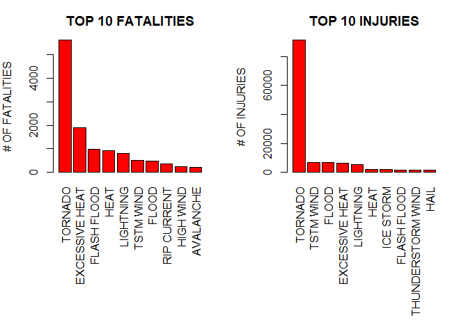

## 1. Synopsis
This project involves exploring the U.S. National Oceanic and Atmospheric Administration's (NOAA) storm database. This database tracks characteristics of major storms and weather events in the United States, including when and where they occur, as well as estimates of any fatalities, injuries, and property damage.

The main objective of this project is to answer the following questions using the NOAA storm database:

1. Which types of events are most harmful with respect to population health?
2. Which types of events have the greatest economic consequences across the United States?

It was selected the following incidents to analysis and to answer these questions: fatalities and injuries (in the case of population health), and property and crop damage (in the case of economic consequences).

The analysis discovered that tornados are the most harmful event across the United States with respect to population health. Floods leads to the greatest economic consequences to properties, and droughts leads to the greatest economic consequences to crops.

## 2. Data Processing
Steps to load dataset into R (it did not any preprocessing outside this document):

1. Download dataset;
2. Unzip the csv file representing dataset;
3. Read the csv file;
4. Note the first lines of csv file;
5. Get the names of required health and economic analysis data;
6. Analysis of the data types;
7. Preprocessing: treat PROPDMGEXP values (PROPDMG = PROPDMG * PROPDMGEXP_preprocessed);
8. Preprocessing: treat CROPDMGEXP values (CROPDMG = CROPDMG * CROPDMGEXP_preprocessed).

Steps 3 and 4

```r
data <- read.csv("../repdata_data_StormData.csv", sep=",", header=TRUE)
head(data)
```

```
##   STATE__           BGN_DATE BGN_TIME TIME_ZONE COUNTY COUNTYNAME STATE
## 1       1  4/18/1950 0:00:00     0130       CST     97     MOBILE    AL
## 2       1  4/18/1950 0:00:00     0145       CST      3    BALDWIN    AL
## 3       1  2/20/1951 0:00:00     1600       CST     57    FAYETTE    AL
## 4       1   6/8/1951 0:00:00     0900       CST     89    MADISON    AL
## 5       1 11/15/1951 0:00:00     1500       CST     43    CULLMAN    AL
## 6       1 11/15/1951 0:00:00     2000       CST     77 LAUDERDALE    AL
##    EVTYPE BGN_RANGE BGN_AZI BGN_LOCATI END_DATE END_TIME COUNTY_END
## 1 TORNADO         0                                               0
## 2 TORNADO         0                                               0
## 3 TORNADO         0                                               0
## 4 TORNADO         0                                               0
## 5 TORNADO         0                                               0
## 6 TORNADO         0                                               0
##   COUNTYENDN END_RANGE END_AZI END_LOCATI LENGTH WIDTH F MAG FATALITIES
## 1         NA         0                      14.0   100 3   0          0
## 2         NA         0                       2.0   150 2   0          0
## 3         NA         0                       0.1   123 2   0          0
## 4         NA         0                       0.0   100 2   0          0
## 5         NA         0                       0.0   150 2   0          0
## 6         NA         0                       1.5   177 2   0          0
##   INJURIES PROPDMG PROPDMGEXP CROPDMG CROPDMGEXP WFO STATEOFFIC ZONENAMES
## 1       15    25.0          K       0                                    
## 2        0     2.5          K       0                                    
## 3        2    25.0          K       0                                    
## 4        2     2.5          K       0                                    
## 5        2     2.5          K       0                                    
## 6        6     2.5          K       0                                    
##   LATITUDE LONGITUDE LATITUDE_E LONGITUDE_ REMARKS REFNUM
## 1     3040      8812       3051       8806              1
## 2     3042      8755          0          0              2
## 3     3340      8742          0          0              3
## 4     3458      8626          0          0              4
## 5     3412      8642          0          0              5
## 6     3450      8748          0          0              6
```
Steps 5 and 6

```r
names(data)
```

```
##  [1] "STATE__"    "BGN_DATE"   "BGN_TIME"   "TIME_ZONE"  "COUNTY"    
##  [6] "COUNTYNAME" "STATE"      "EVTYPE"     "BGN_RANGE"  "BGN_AZI"   
## [11] "BGN_LOCATI" "END_DATE"   "END_TIME"   "COUNTY_END" "COUNTYENDN"
## [16] "END_RANGE"  "END_AZI"    "END_LOCATI" "LENGTH"     "WIDTH"     
## [21] "F"          "MAG"        "FATALITIES" "INJURIES"   "PROPDMG"   
## [26] "PROPDMGEXP" "CROPDMG"    "CROPDMGEXP" "WFO"        "STATEOFFIC"
## [31] "ZONENAMES"  "LATITUDE"   "LONGITUDE"  "LATITUDE_E" "LONGITUDE_"
## [36] "REMARKS"    "REFNUM"
```

```r
data_required <- c("EVTYPE", "FATALITIES", "INJURIES", "PROPDMG", "PROPDMGEXP", "CROPDMG", "CROPDMGEXP")
data <- data[data_required]
head(data)
```

```
##    EVTYPE FATALITIES INJURIES PROPDMG PROPDMGEXP CROPDMG CROPDMGEXP
## 1 TORNADO          0       15    25.0          K       0           
## 2 TORNADO          0        0     2.5          K       0           
## 3 TORNADO          0        2    25.0          K       0           
## 4 TORNADO          0        2     2.5          K       0           
## 5 TORNADO          0        2     2.5          K       0           
## 6 TORNADO          0        6     2.5          K       0
```


```r
#unique(data$EVTYPE)
#unique(data$FATALITIES)
#unique(data$INJURIES)
#unique(data$PROPDMG)
unique(data$PROPDMGEXP)
```

```
##  [1] K M   B m + 0 5 6 ? 4 2 3 h 7 H - 1 8
## Levels:  - ? + 0 1 2 3 4 5 6 7 8 B h H K m M
```

Step 7 (records like "+", "-", "?" were treated as 0)

```r
library(dplyr)
```

```
## 
## Attaching package: 'dplyr'
```

```
## The following objects are masked from 'package:stats':
## 
##     filter, lag
```

```
## The following objects are masked from 'package:base':
## 
##     intersect, setdiff, setequal, union
```

```r
data <- data %>%
        mutate(PROPDMG = PROPDMG * case_when(
                PROPDMGEXP == "H" ~ 1e+02,
                PROPDMGEXP == "h" ~ 1e+02,
                PROPDMGEXP == "K" ~ 1e+03,
                PROPDMGEXP == "M" ~ 1e+06,
                PROPDMGEXP == "m" ~ 1e+06,
                PROPDMGEXP == "B" ~ 1e+09,
                PROPDMGEXP == "0" ~ 1,
                PROPDMGEXP == "1" ~ 10,
                PROPDMGEXP == "2" ~ 1e+02,
                PROPDMGEXP == "3" ~ 1e+03,
                PROPDMGEXP == "4" ~ 1e+04,
                PROPDMGEXP == "5" ~ 1e+05,
                PROPDMGEXP == "6" ~ 1e+06,
                PROPDMGEXP == "7" ~ 1e+07,
                PROPDMGEXP == "8" ~ 1e+08,
                PROPDMGEXP == "" ~ 1,
                PROPDMGEXP == "+" ~ 0,
                PROPDMGEXP == "-" ~ 0,
                PROPDMGEXP == "?" ~ 0
        ), PROPDMGEXP=NULL
        )
```

Step 6, again (other columns)

```r
#unique(data$CROPDMG)
unique(data$CROPDMGEXP)
```

```
## [1]   M K m B ? 0 k 2
## Levels:  ? 0 2 B k K m M
```

Step 8 (records like "+", "-", "?" were treated as 0)

```r
data <- data %>%
        mutate(CROPDMG = CROPDMG * case_when(
                CROPDMGEXP == "K" ~ 1e+03,
                CROPDMGEXP == "k" ~ 1e+03,
                CROPDMGEXP == "M" ~ 1e+06,
                CROPDMGEXP == "m" ~ 1e+06,
                CROPDMGEXP == "B" ~ 1e+09,
                CROPDMGEXP == 0 ~ 1,
                CROPDMGEXP == 2 ~ 1e+02,
                CROPDMGEXP == "" ~ 1,
                CROPDMGEXP == "?" ~ 0
        ), CROPDMGEXP=NULL
        )
```

## 3. Data Analysis
Calculate the totals of each incident by event type.

1. Population health events: fatalities and injuries top 10;
2. Plot top 10 health issues;
3. Economic problem events: property and crop damages top 10;
4. Plot top 10 economic issues.

```r
head(data)
```

```
##    EVTYPE FATALITIES INJURIES PROPDMG CROPDMG
## 1 TORNADO          0       15   25000       0
## 2 TORNADO          0        0    2500       0
## 3 TORNADO          0        2   25000       0
## 4 TORNADO          0        2    2500       0
## 5 TORNADO          0        2    2500       0
## 6 TORNADO          0        6    2500       0
```

```r
# 3.1. Population health events
health_events_by_fatality <- aggregate(FATALITIES ~ EVTYPE, data, FUN=sum)

health_events_by_injury <- aggregate(INJURIES ~ EVTYPE, data, FUN=sum)

fatalities_top10 <- health_events_by_fatality[with(health_events_by_fatality, order(-FATALITIES)),]

injuries_top10 <- health_events_by_injury[with(health_events_by_injury, order(-INJURIES)),]

population_issues_top10 <- cbind(
        head(fatalities_top10, 10),
        head(injuries_top10, 10))

print(population_issues_top10)
```

```
##             EVTYPE FATALITIES            EVTYPE INJURIES
## 834        TORNADO       5633           TORNADO    91346
## 130 EXCESSIVE HEAT       1903         TSTM WIND     6957
## 153    FLASH FLOOD        978             FLOOD     6789
## 275           HEAT        937    EXCESSIVE HEAT     6525
## 464      LIGHTNING        816         LIGHTNING     5230
## 856      TSTM WIND        504              HEAT     2100
## 170          FLOOD        470         ICE STORM     1975
## 585    RIP CURRENT        368       FLASH FLOOD     1777
## 359      HIGH WIND        248 THUNDERSTORM WIND     1488
## 19       AVALANCHE        224              HAIL     1361
```


```r
# 3.2. Plot top 10 health issues
library(ggplot2)
```

```
## Registered S3 methods overwritten by 'ggplot2':
##   method         from 
##   [.quosures     rlang
##   c.quosures     rlang
##   print.quosures rlang
```

```r
fat_top10_plot <- head(population_issues_top10[1:10,1:2], 10)
inj_top10_plot <- head(population_issues_top10[1:10,3:4], 10)

par(mfrow=c(1,2),mar=c(12,4,3,2))
barplot(fat_top10_plot$FATALITIES,
        names.arg=fat_top10_plot$EVTYPE,
        las=3,
        ylab="# OF FATALITIES",
        col="red",
        main="TOP 10 FATALITIES")
barplot(inj_top10_plot$INJURIES,
        names.arg=inj_top10_plot$EVTYPE,
        las=3,
        ylab="# OF INJURIES",
        col="red",
        main="TOP 10 INJURIES")
```

<!-- -->

### Tornado is the most harmful event across the United States with respect to population health. It represents 5.633 fatalities cases, and 91.3456 injuries cases.


```r
# 3.3. Economic Problem Events
economic_problems_by_property <- aggregate(PROPDMG ~ EVTYPE, data, FUN=sum)

economic_problems_by_crop <- aggregate(CROPDMG ~ EVTYPE, data, FUN=sum)

property_top10 <- economic_problems_by_property[with(economic_problems_by_property, order(-PROPDMG)),]

crop_top10 <- economic_problems_by_crop[with(economic_problems_by_crop, order(-CROPDMG)),]


economic_issues_top10 <- cbind(
        head(property_top10, 10),
        head(crop_top10, 10))

print(economic_issues_top10)
```

```
##                EVTYPE      PROPDMG            EVTYPE     CROPDMG
## 170             FLOOD 144657709807           DROUGHT 13972566000
## 411 HURRICANE/TYPHOON  69305840000             FLOOD  5661968450
## 834           TORNADO  56947380617       RIVER FLOOD  5029459000
## 670       STORM SURGE  43323536000         ICE STORM  5022113500
## 153       FLASH FLOOD  16822673979              HAIL  3025954473
## 244              HAIL  15735267513         HURRICANE  2741910000
## 402         HURRICANE  11868319010 HURRICANE/TYPHOON  2607872800
## 848    TROPICAL STORM   7703890550       FLASH FLOOD  1421317100
## 972      WINTER STORM   6688497251      EXTREME COLD  1292973000
## 359         HIGH WIND   5270046260      FROST/FREEZE  1094086000
```


```r
# 3.4. Plot top 10 economic issues
prop_top10_plot <- head(economic_issues_top10[1:10,1:2], 10)
crop_top10_plot <- head(economic_issues_top10[1:10,3:4], 10)

par(mfrow=c(1,2),mar=c(12,4,3,2))
barplot(prop_top10_plot$PROPDMG/(1e+09),
        names.arg=prop_top10_plot$EVTYPE,
        las=3,
        ylab="(IN BILLIONS)",
        col="yellow",
        main="TOP 10 PROPERTY DAMAGES")
barplot(crop_top10_plot$CROPDMG/(1e+09),
        names.arg=crop_top10_plot$EVTYPE,
        las=3,
        ylab="(IN BILLIONS)",
        col="yellow",
        main="TOP 10 CROP DAMAGES")
```

<!-- -->

### Flood events has the greatest economic consequences to property, representing US\$144.657.709.807 of loss. Drought events has the greatest economic consequences to crop, representing US\$13.972.566.000 of loss.

## 4. Results
- **Question 1:** Across the United States, which types of events are most harmful with respect to population health?

**Answer: Tornado** is the most harmful event across the United States with respect to population health. It represents 5.633 fatalities cases, and 91.3456 injuries cases.

Specifically with respect **fatalities**, tornado event is followed by these most harmful events:

2. Excessive heat
3. Flash flood
4. Heat
5. Lightning
6. TSTM wind
7. Flood
8. RIP current
9. High wind
10. Avalanche

Specifically with respect **injuries**, tornado event is followed by these most harmful events:

2. TSTM wind
3. Flood
4. Excessive heat
5. Lightning
6. Heat
7. Ice storm
8. Flash Flood
9. Thunderstorm wind
10. Hail

- **Question 2:** Across the United States, which types of events have the greatest economic consequences?

**Answer: Flood** events has the greatest economic consequences to property, representing US\$144.657.709.807 of loss. **Drought** events has the greatest economic consequences to crop, representing US\$13.972.566.000 of loss.

Specifically with respect **properties**, flood event is followed by these most harmful events:

2. Hurricane/Typhoon
3. Tornado
4. Storm Surge
5. Flash flood
6. Hail
7. Hurricane
8. Tropical storm
9. Winter storm
10. High wind

Specifically with respect **crops**, drought event is followed by these most harmful events:

2. Flood
3. River flood
4. Ice storm
5. Hail
6. Hurricane
7. Hurricane/Typhoon
8. Flash flood
9. Extreme cold
10. Frost/Freeze
